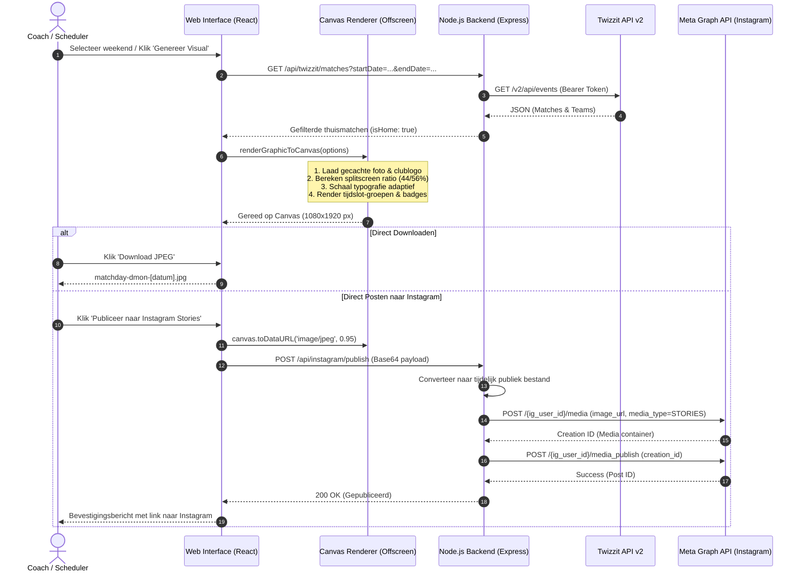

# D-Mon Hockey Match Announcer 🏑

Geautomatiseerde match graphic generator en Instagram Stories publisher voor D-Mon Hockey (Dendermonde) op basis van de Twizzit API en de club brand identity.

---

## 🚀 Features

- **Twizzit API Synchronisatie**:
  - Automatische opvraging van weekend-wedstrijden via de officiële Twizzit API (Organisatie `#32037`).
  - Slimme server-side caching (standaard 4 uur) & rate-limit bewaking (500 queries/maand limiet) om Twizzit API quota te sparen.
  - Slimme filter: enkel **thuismatchen** (`isHome: true`) worden geselecteerd.
- **Canva-stijl Grafische Generator**:
  - Renderen van Instagram Stories (9:16) en Vierkant (1:1) visuals via HTML5 Canvas.
  - Clubkleuren: D-Mon Navy Blue (`#06478D`), Vibrant Scarlet (`#E30613`), White & Accenten.
  - Officiële D-Mon clubbadge met automatische achtergronddetectie.
  - Custom drag-and-drop foto-upload en persistente fotobibliotheek.
  - Dynamic highlight van topmatchen (bv. Dames 1 & Heren 1) en veldallocatie (Veld 1, Veld 2).
- **Instagram Publishing Engine**:
  - Direct posten naar Instagram Stories via de Meta Graph API.
  - Direct downloaden van JPEG's voor handmatige publicatie.
  - Automatisch gegenereerd bijschrift met hashtags en matchoverzicht.
- **Wekelijkse Automatisatie & Decision Engine**:
  - Gepland tijdslot (bv. elke vrijdag om 10:00).
  - **No-Match Rule**: Wanneer er geen thuismatchen zijn in een weekend, wordt er automatisch geen post aangemaakt en een duidelijke statuslog gegenereerd.
- **Toegangsbeveiliging**:
  - Beschermd inlogsysteem voor coaches en communicatieverantwoordelijken.

---

## 🛠️ Configuratie (Omgevingsvariabelen)

Kopieer `.env.example` naar `.env` en configureer de vereiste variabelen:

```env
# Twizzit API Gegevens
TWIZZIT_USERNAME="jouw_twizzit_gebruikersnaam"
TWIZZIT_PASSWORD="jouw_twizzit_wachtwoord"
TWIZZIT_ORG_ID="32037"

# Toegang tot de Webapp
APP_AUTH_USER="jouw_beheerdersnaam"
APP_AUTH_PASSWORD="jouw_sterk_wachtwoord"

# Instagram Meta Graph API
INSTAGRAM_ACCOUNT_ID="17841409458406570"
INSTAGRAM_ACCESS_TOKEN="jouw_meta_graph_token"
```

---

## 🎨 Hoe wordt een visual/image gegenereerd?

De applicatie maakt gebruik van een **high-resolution HTML5 Canvas rendering engine** (`1080x1920` px voor Instagram Stories of `1080x1080` px voor Feed posts). De afbeelding wordt programmatisch opgebouwd via offscreen double-buffering om flikkeringen te voorkomen en scherpe typografie te garanderen.

### 1. Flowchart: Van Wedstrijddata tot Instagram Story

```mermaid
flowchart TD
    A[Start: Wekelijkse trigger of Coach klik] --> B[Twizzit API Synchronisatie]
    B --> C{Zijn er thuismatchen?}
    
    C -- Nee --> D[No-Match Rule: Geen post aanmaken]
    D --> E[Status log: 0 thuismatchen geregistreerd]
    
    C -- Ja --> F[Data normalisatie & Groepering per dag & aftrap-uur]
    F --> G[Selecteer clubfoto & Brand kit instellingen]
    
    subgraph HTML5_Canvas_Engine [HTML5 Canvas Rendering Engine (1080x1920)]
        H[Laag 1: Foto Cover-Fill + Gradient Overlay] --> I[Laag 2: Clubblauw Vlak + SVG Hockeyveld Lijnen]
        I --> J[Laag 3: D-Mon Logo Badge + Dynamic Header]
        J --> K[Laag 4: Adaptive Match Rooster & Tijdslot Groepering]
        K --> L[Laag 5: Footer, Vrijwilligersbadge & Handle @dmon_hockey]
    end
    
    G --> H
    L --> M[Export: Canvas naar JPEG 95% Kwaliteit]
    
    M --> N{Publicatie methode}
    N -- Download --> O[Directe JPEG Download naar apparaat]
    N -- Instagram Story --> P[POST /api/instagram/publish]
    P --> Q[Meta Graph API: Upload naar Media Container]
    Q --> R[Meta Graph API: Container Publiceren naar IG Story]
```

---

### 2. Sequence Diagram: Component Interactie



---

### 3. De 5 Visuele Renderlagen in detail

1. **Achtergrond & Splitscreen (`splitRatio`)**:
   - De linkerkant toont de geselecteerde club- of actiefoto, gecentreerd gecropt (`object-fit: cover` wiskundig berekend op canvas).
   - Onderaan de foto zit een zachte gradient overlay om het handgeschreven vrijwilligersaccent (*"Bar open dankzij onze vrijwilligers"*) leesbaar te houden.
   - De rechterkant (standaard 56% van de breedte voor weekenden) bevat het solide D-Mon Clubblauw (`#06478D`) of een clubgradiënt.
2. **Subtiele Hockeyveld Lijnen (SVG Texture)**:
   - Een wiskundig gegenereerde vector van een hockeyveld (middenlijn, 23m-lijnen, slagcirkels) wordt met 8-12% opaciteit over het blauwe vlak gerenderd voor een premium clubgevoel.
3. **Logo Badge & Typografie**:
   - Het ronde transparante clubembleem van D-Mon Hockey wordt linksboven geplaatst met een subtiele schaduw.
   - Headers worden gerenderd in **Outfit** (900 bold) en **Barlow** (subtitels) met dynamic date pill (bv. `12/09 - 13/09`).
4. **Adaptive Match Layout Engine**:
   - Wedstrijden worden automatisch gesplitst in **Zaterdag** en **Zondag**.
   - Identieke aftrapuren worden samengevoegd (`groupMatchesByTime`), zodat meerdere matchen op hetzelfde tijdstip strak onder één tijdsblokje staan.
   - **Dynamic Font Scaling**: Indien er veel matchen zijn (bv. 8+ wedstrijden in één weekend), past de engine automatisch de lettergroottes en regelafstanden aan zodat alle matchen altijd binnen de veilige Instagram Story marges passen zonder overflow.
   - Belangrijke matchen (Dames 1 / Heren 1) krijgen een opvallend clubrood accent (`#E30613`) en veldbadges (`Veld 1`, `Veld 2`).
5. **Footer & Branding**:
   - Bevat de officiële clublocatie (*Dendermonde Hockey Club • Sint-Gillis*) en het officiële Instagram-kanaal (`@dmon_hockey`).

---

## 💻 Lokale Installatie & Opstarten

```bash
# 1. Installeer dependencies
npm install

# 2. Start de development server (poort 3000)
npm run dev

# 3. Productie build
npm run build
npm start
```

---

## 🔒 Beveiliging

Alle API credentials en tokens worden uitsluitend aan de serverzijde (`server.ts`) verwerkt en worden nooit blootgesteld aan de browser. Er bevinden zich geen hardcoded geheimen of tokens in deze repository.
