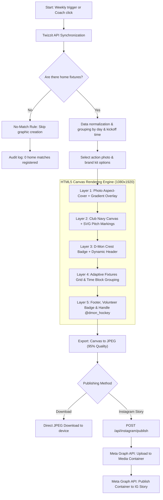
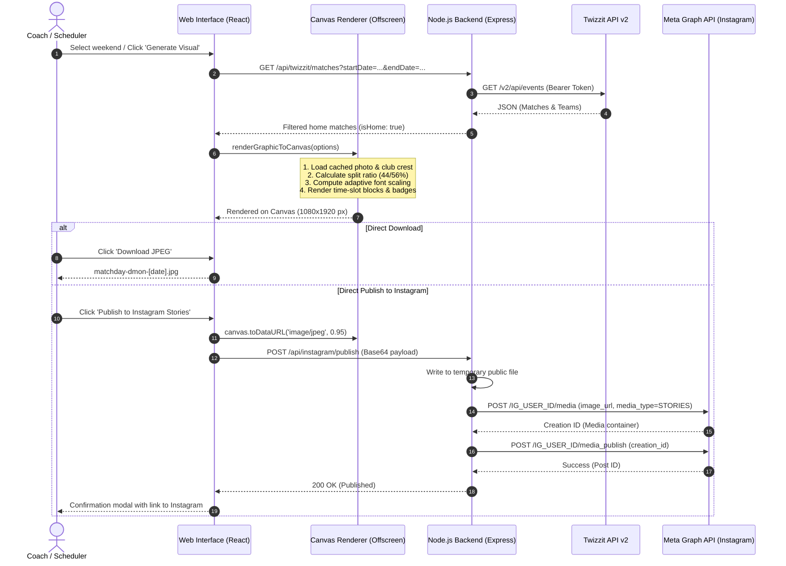

# D-Mon Hockey Match Announcer 🏑

Automated match graphic generator and Instagram Stories publisher for D-Mon Hockey (Dendermonde), powered by live Twizzit API fixtures and the official club brand identity.

---

## 🚀 Features

- **Twizzit API Synchronization**:
  - Automated retrieval of weekend fixtures via the official Twizzit API (Organization `#32037`).
  - Intelligent server-side caching (4-hour default TTL) & quota guard (500 queries/month limit) to conserve Twizzit API rate limits.
  - Smart home game filter: only home fixtures (`isHome: true`) are selected for publication.
- **Canva-style Graphic Generator**:
  - High-resolution rendering of Instagram Stories (9:16 / 1080×1920) and Feed posts (1:1 / 1080×1080) via HTML5 Canvas.
  - Official brand palette: D-Mon Navy Blue (`#06478D`), Vibrant Scarlet (`#E30613`), Crisp White & Accents.
  - Official D-Mon crest badge with automatic dark/light background detection.
  - Custom drag-and-drop photo upload with persistent local photo library.
  - Dynamic highlight for flagship teams (e.g., Dames 1 & Heren 1) and pitch allocation (Pitch 1, Pitch 2).
- **Instagram Publishing Engine**:
  - Direct 1-click publishing to Instagram Stories via the Meta Graph API.
  - High-res JPEG export for manual sharing across WhatsApp, Facebook, or web.
  - Auto-generated caption with relevant hashtags and match summaries.
- **Weekly Automation & Decision Engine**:
  - Scheduled publication slot (e.g., every Friday morning).
  - **No-Match Rule**: If no home fixtures are scheduled for the weekend, graphic generation and publication are skipped automatically, logging a clean audit status.
- **Access Protection**:
  - Password-protected login system for coaches and communications coordinators.

---

## 🛠️ Configuration (Environment Variables)

Copy `.env.example` to `.env` and configure the required credentials:

```env
# Twizzit API Credentials
TWIZZIT_USERNAME="your_twizzit_username"
TWIZZIT_PASSWORD="your_twizzit_password"
TWIZZIT_ORG_ID="32037"

# Webapp Access Credentials
APP_AUTH_USER="your_admin_username"
APP_AUTH_PASSWORD="your_secure_password"

# Instagram Meta Graph API
INSTAGRAM_ACCOUNT_ID="17841409458406570"
INSTAGRAM_ACCESS_TOKEN="your_meta_graph_access_token"
```

---

## 🎨 How Graphics Are Generated

The application uses a **high-resolution HTML5 Canvas rendering engine** (`1080x1920` px for Instagram Stories or `1080x1080` px for Feed posts). Graphics are rendered programmatically using an offscreen canvas buffer to eliminate flicker and guarantee pixel-perfect typography.

### 1. Flowchart: From Fixture Data to Instagram Story



---

### 2. Sequence Diagram: Component Interaction



---

### 3. The 5 Visual Render Layers in Detail

1. **Background & Split Screen (`splitRatio`)**:
   - The left pane showcases the chosen action photo, cropped with `object-fit: cover` math to fill its allocated space without distortion.
   - A bottom gradient ensures readability for the handwritten volunteer note (*"Bar open thanks to our volunteers"*).
   - The right pane (default 56% width for multi-game weekends) is painted in D-Mon Navy Blue (`#06478D`) or a subtle club gradient.
2. **Subtle Hockey Pitch Markings (SVG Vector Texture)**:
   - Mathematically rendered field lines (center line, 23m lines, striking circles) are applied across the navy pane at 8–12% opacity to add depth and authenticity.
3. **Crest Badge & Typography**:
   - The circular transparent D-Mon Hockey crest is positioned in the upper-left corner with a soft drop shadow.
   - Headlines use **Outfit** (900 bold weight) paired with **Barlow** (subtitles) and a dynamic date pill (e.g., `12/09 - 13/09`).
4. **Adaptive Match Layout Engine**:
   - Fixtures are segregated into **Saturday** and **Sunday** columns.
   - Matching kickoff times are grouped (`groupMatchesByTime`), consolidating multiple concurrent matches cleanly under one time header.
   - **Dynamic Font Scaling**: When high match volume is detected (e.g., 8+ games in a weekend), the engine automatically scales down font sizes and line heights so all games fit within Instagram Story safe zones without clipping.
   - Flagship matches (Dames 1 / Heren 1) receive a vibrant scarlet accent (`#E30613`) and pitch badges (`Pitch 1`, `Pitch 2`).
5. **Footer & Branding**:
   - Displays official club venue location (*Dendermonde Hockey Club • Sint-Gillis*) and official Instagram handle (`@dmon_hockey`).

---

## 💻 Local Installation & Setup

```bash
# 1. Install dependencies
npm install

# 2. Start the development server (port 3000)
npm run dev

# 3. Production build
npm run build
npm start
```

---

## 🔒 Security & Credential Isolation

All third-party API credentials, tokens, and secrets are handled strictly server-side (`server.ts`) and are never leaked to client browsers. This repository contains zero hardcoded secrets or access tokens.

