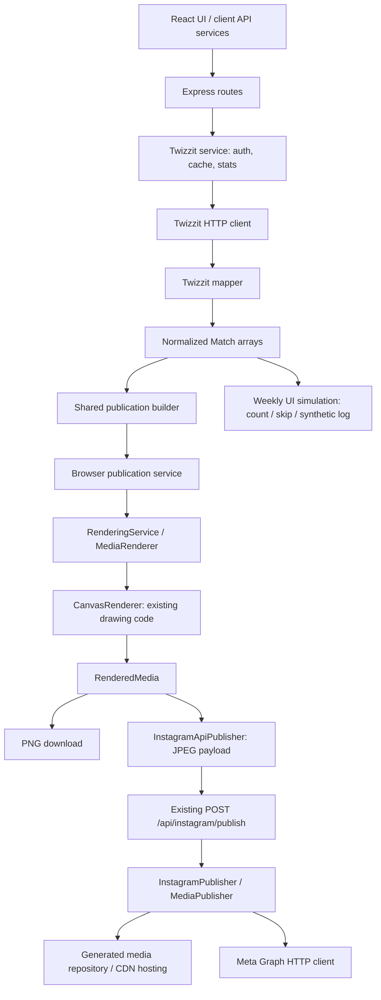
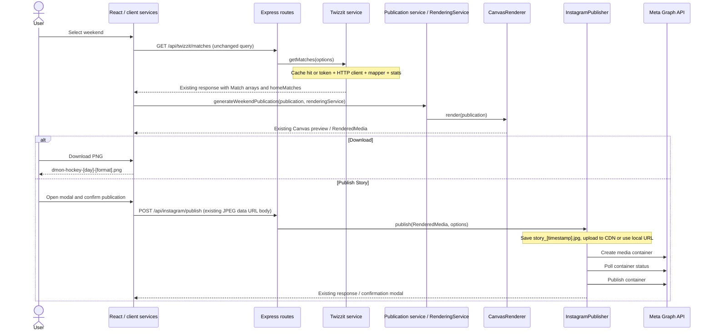

# D-Mon Hockey Match Announcer 🏑

Automated match graphic generator and Instagram Stories publisher for D-Mon Hockey (Dendermonde), powered by live Twizzit API fixtures and the official club brand identity.

---

## 🚀 Features

- **Twizzit API Synchronization**:
  - Automated retrieval of weekend fixtures via the official Twizzit API (Organization `#32037`).
  - Server-side caching (4-hour default TTL) and monthly query accounting (reported limit: 500) to conserve Twizzit API rate limits.
  - Smart home game filter: only home fixtures (`isHome: true`) are selected for publication.
- **Canva-style Graphic Generator**:
  - High-resolution rendering of Instagram Stories (9:16 / 1080×1920) and Feed posts (1:1 / 1080×1080) via HTML5 Canvas.
  - Official brand palette: D-Mon Navy Blue (`#06478D`), Vibrant Scarlet (`#E30613`), Crisp White & Accents.
  - Official D-Mon crest badge with automatic dark/light background detection.
  - Custom drag-and-drop photo upload with persistent local photo library.
  - Dynamic highlight for flagship teams (e.g., Dames 1 & Heren 1) and pitch allocation (Pitch 1, Pitch 2).
- **Instagram Publishing Engine**:
  - Direct 1-click publishing to Instagram Stories via the Meta Graph API.
  - High-resolution PNG download for manual sharing; JPEG encoding for Instagram publishing.
  - Auto-generated caption with relevant hashtags and match summaries.
- **Weekly Automation & Decision Engine**:
  - Schedule configuration UI (e.g., every Friday morning) and a manual pipeline simulation; no background scheduler is implemented.
  - **No-Match Rule**: The manual pipeline simulation logs a skipped decision when there are no home fixtures. A simulated POSTED decision does not publish to Meta.
- **Access Protection**:
  - Password-protected login system for coaches and communications coordinators.

---

## 🛠️ Configuration (Environment Variables)

Copy `.env.example` to `.env` and configure the required credentials:

```env
# Twizzit API Credentials
TWIZZIT_USERNAME="your_twizzit_username"
TWIZZIT_PASSWORD="your_twizzit_password"
TWIZZIT_ORG_ID="32037"

# Webapp Access Credentials
APP_AUTH_USER="your_admin_username"
APP_AUTH_PASSWORD="your_secure_password"

# Instagram Meta Graph API
INSTAGRAM_ACCOUNT_ID="17841409458406570"
INSTAGRAM_ACCESS_TOKEN="your_meta_graph_access_token"
```

---

## 🎨 How Graphics Are Generated

The application uses a **high-resolution HTML5 Canvas rendering engine** (`1080x1920` px for Instagram Stories or `1080x1080` px for Feed posts). Graphics are rendered programmatically using an offscreen canvas buffer to eliminate flicker and guarantee pixel-perfect typography.

### 1. Flowchart: From Fixture Data to Instagram Story


```mermaid
flowchart TD
    UI["React UI / client API services"] --> Routes["Express routes"]
    Routes --> TwizzitService["Twizzit service: auth, cache, stats"]
    TwizzitService --> Twizzit["Twizzit HTTP client"]
    Twizzit --> Mapper["Twizzit mapper"]
    Mapper --> Match["Normalized Match arrays"]
    Match --> Publication["Shared publication builder"]
    Publication --> Pipeline["Browser publication service"]
    Pipeline --> Rendering["RenderingService / MediaRenderer"]
    Rendering --> Canvas["CanvasRenderer: existing drawing code"]
    Canvas --> Media["RenderedMedia"]
    Media --> Download["PNG download"]
    Media --> BrowserPublisher["InstagramApiPublisher: JPEG payload"]
    BrowserPublisher --> IGRoute["Existing POST /api/instagram/publish"]
    IGRoute --> Publisher["InstagramPublisher / MediaPublisher"]
    Publisher --> Hosting["Generated media repository / CDN hosting"]
    Publisher --> Meta["Meta Graph HTTP client"]
    Match --> Simulation["Weekly UI simulation: count / skip / synthetic log"]
```

---

### 2. Sequence Diagram: Component Interaction


```mermaid
sequenceDiagram
    actor User
    participant UI as React / client services
    participant Routes as Express routes
    participant Data as Twizzit service
    participant Rendering as Publication service / RenderingService
    participant Canvas as CanvasRenderer
    participant Publisher as InstagramPublisher
    participant Meta as Meta Graph API

    User->>UI: Select weekend
    UI->>Routes: GET /api/twizzit/matches (unchanged query)
    Routes->>Data: getMatches(options)
    Note over Data: Cache hit or token + HTTP client + mapper + stats
    Data-->>UI: Existing response with Match arrays and homeMatches
    UI->>Rendering: generateWeekendPublication(publication, renderingService)
    Rendering->>Canvas: render(publication)
    Canvas-->>UI: Existing Canvas preview / RenderedMedia
    alt Download
        User->>UI: Download PNG
        UI-->>User: dmon-hockey-[day]-[format].png
    else Publish Story
        User->>UI: Open modal and confirm publication
        UI->>Routes: POST /api/instagram/publish (existing JPEG data URL body)
        Routes->>Publisher: publish(RenderedMedia, options)
        Note over Publisher: Save story_[timestamp].jpg, upload to CDN or use local URL
        Publisher->>Meta: Create media container
        Publisher->>Meta: Poll container status
        Publisher->>Meta: Publish container
        Publisher-->>UI: Existing response / confirmation modal
    end
```

---

### 3. The 5 Visual Render Layers in Detail

1. **Background & Split Screen (`splitRatio`)**:
   - The left pane showcases the chosen action photo, cropped with `object-fit: cover` math to fill its allocated space without distortion.
   - A bottom gradient ensures readability for the handwritten volunteer note (*"Bar open thanks to our volunteers"*).
   - The right pane (default 56% width for multi-game weekends) is painted in D-Mon Navy Blue (`#06478D`) or a subtle club gradient.
2. **Subtle Hockey Pitch Markings (SVG Vector Texture)**:
   - Mathematically rendered field lines (center line, 23m lines, striking circles) are applied across the navy pane at 8–12% opacity to add depth and authenticity.
3. **Crest Badge & Typography**:
   - The circular transparent D-Mon Hockey crest is positioned in the upper-left corner with a soft drop shadow.
   - Headlines use **Outfit** (900 bold weight) paired with **Barlow** (subtitles) and a dynamic date pill (e.g., `12/09 - 13/09`).
4. **Adaptive Match Layout Engine**:
   - Fixtures are segregated into **Saturday** and **Sunday** columns.
   - Matching kickoff times are grouped (`groupMatchesByTime`), consolidating multiple concurrent matches cleanly under one time header.
   - **Dynamic Font Scaling**: When high match volume is detected (e.g., 8+ games in a weekend), the engine automatically scales down font sizes and line heights so all games fit within Instagram Story safe zones without clipping.
   - Flagship matches (Dames 1 / Heren 1) receive a vibrant scarlet accent (`#E30613`) and pitch badges (`Pitch 1`, `Pitch 2`).
5. **Footer & Branding**:
   - Displays official club venue location (*Dendermonde Hockey Club • Sint-Gillis*) and official Instagram handle (`@dmon_hockey`).

---

## 💻 Local Installation & Setup

```bash
# 1. Install dependencies
npm install

# 2. Start the development server (port 3000)
npm run dev

# 3. Production build
npm run build
npm start
```

---

## 🔒 Security & Credential Isolation

Third-party credentials are read by `src/server/config/env.ts` and used only by server modules. Client services call the existing HTTP endpoints. The existing authentication/session model and fallback secret remain unchanged.


## Architecture and verification

```text
server.ts                       Express/Vite bootstrap; port 3000
src/server/app.ts               Middleware, route composition and static assets
src/server/config/              Server environment variables and filesystem paths
src/server/auth/                Existing login/session behavior
src/server/twizzit/              HTTP client, token cache, mapping, JSON cache/statistics, service
src/server/photos/              Photo service and filesystem repository
src/server/persistence/         Generated image files and public URL construction
src/server/publishing/          Publisher interface, CDN hosting, Instagram orchestration/HTTP client
src/server/routes/              Existing API paths and response/error translation
src/shared/types/               Match, publication, rendering, publishing, photo and UI models
src/shared/domain/              Date helpers, match grouping and publication preparation
src/client/components/          Existing React screens
src/client/services/            HTTP adapters, rendering and publication orchestration
src/client/rendering/           CanvasRenderer, unchanged drawing code and JPEG conversion
src/client/publishing/          Browser adapter to the existing Instagram endpoint
src/client/automation/          Existing weekly simulation; no background scheduler
src/client/persistence/         Existing IndexedDB/localStorage behavior
src/client/hooks/               Canvas preview surface adapter
```

Canvas is the only active `MediaRenderer`. `MatchPublication` contains normalized matches and the existing settings; `RenderingService` accepts an injected renderer and returns `RenderedMedia`. A future CanvaRenderer would implement this interface and be registered at the browser composition/preview adapter. Its publishing export must provide the JPEG data URL accepted by the current endpoint. No Canva integration, configuration or OAuth is implemented.

`InstagramPublisher` implements `MediaPublisher`, orchestrating the existing generated-file/CDN handling and Meta calls. Browser and server responsibilities remain separate because Canvas runs in the browser.

Run `npm run lint`, `npm run build` and `npm test`. Tests use Node's built-in test runner with the existing tsx/esbuild dependencies. They cover deterministic domain logic, browser services/storage, the weekly simulation, 28 API parity scenarios captured before extraction, and nine original Canvas drawing traces. HTTP and files are mocked in the parity suite; it does not use live credentials. Drawing traces use deterministic text measurements and are not pixel screenshot tests.

See [the refactor baseline and manual checklist](docs/refactor-baseline.md) and [the refactor report and file inventory](docs/refactor-report.md).
